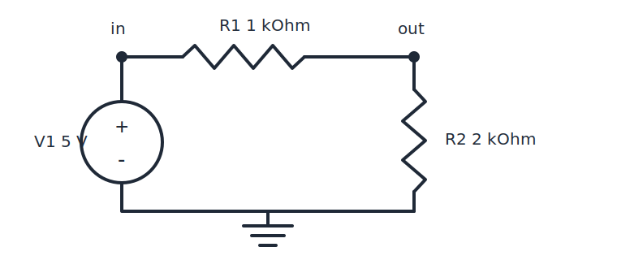

# lean_models

Prove real Python / C++ / Rust / SystemVerilog programs correct in Lean 4.

Each language gets a **deep embedding**: the program's real AST becomes a Lean
value, and a definitional interpreter gives it meaning. Programs stay
**source-shaped** — the Lean term mirrors the file you wrote — so specs and
proofs read against code you recognize, which is what makes AI-assisted proving
tractable.

## Design: four decoupled coverage axes

Coverage on each axis grows independently; nothing on a lower axis blocks a
higher one, and nothing is ever silently faked.

1. **Parse coverage** — borrow each language's own frontend (CPython `ast`,
   Clang, slang, syn). Extractors are thin dumpers into a standardized JSON
   envelope ([docs/envelope-schema.md](docs/envelope-schema.md)).
2. **Representation coverage** — full ASTs in Lean; constructs outside the
   supported vocabulary become `Unsupported` nodes, so ingestion never fails.
3. **Semantic coverage** — tiered, executable, definitional interpreters that
   fail *loudly* (`Res.unsupported`) outside the supported tier. Coverage is
   measured on real corpora.
4. **Proof coverage** — the spec/Hoare layer lags semantics, by design.

**The oracle principle:** all nondeterminism is an explicit oracle parameter of
the semantics. Irrelevant for straight-line Python; essential for
SystemVerilog, where the simulation scheduler's choices become a quantified
argument and theorems can range over *all* legal schedules.

**Validation:** the interpreter is differentially tested against the real
implementation (CPython here) on shared test cases — the semantics is checked
against ground truth, not against our own reading of the spec.

See [docs/DESIGN.md](docs/DESIGN.md) for the full normative contract.

## v0: the Python vertical slice

The workflow — the **three-file example layout**
(`Examples/<language>/<name>/`):

1. Put a pure Python file in its own example directory: `Examples/python/tri/tri.py`.
   No annotations; nothing in it knows Lean exists.
2. Run the extractor:
   `python3 extractors/python/extract.py Examples/python/tri/tri.py`
   This emits `Examples/python/tri/tri.json` — the AST envelope, next to the
   source — and nothing else.
3. Write two Lean files beside it. `spec.lean` is the readable contract:
   the program load, the `#py_check` non-vacuity runs, and every theorem
   *statement*, each proved `:= by proofs`. `proof.lean` holds the real
   proofs. `lake build` ingests the JSON at elaboration time, defines
   `tri : Module` as a literal AST term, and checks everything.

Proof work iterates in **pure Lean**: edit `spec.lean`/`proof.lean`,
rebuild. The extractor re-enters the loop only when the `.py` itself
changes (then re-run step 2 to refresh the envelope).

### Example: `Examples/python/tri/`

```python
# Examples/python/tri/tri.py (the whole program)
def tri(n):
    total, i = 0, 0
    while i <= n:
        total += i
        i += 1
    return total
```

```lean
-- Examples/python/tri/spec.lean (excerpt)
load_program tri from "Examples/python/tri/tri.json"

#py_check tri(10) = 55
#py_check tri(0) = 0
...
theorem tri_total (n : PyInt) (hn : 0 ≤ n) : tri(n) ==> n * (n + 1) / 2 := by proofs
```

The theorem says: for every `n ≥ 0`, running the *actual Python program*
through the verified interpreter terminates and returns `n(n+1)/2`. And the
proof — in `Examples/python/tri/proof.lean`, where the statement is restated under
the same name (Lean has no forward declarations; the spec-side `:= by proofs`
resolves the twin and typechecks the duplication) — is only the content no
tactic can invent: the loop invariant, the decreasing measure, and closing
arithmetic:

```lean
-- Examples/python/tri/proof.lean (proof body; illustrative until the vcgen campaign lands)
theorem tri_total (n : PyInt) (hn : 0 ≤ n) : tri(n) ==> n * (n + 1) / 2 := by
  py_begin [tri]
  py_loop (inv := fun (total i : Int) => 0 ≤ i ∧ i ≤ n + 1 ∧ 2 * total = i * (i - 1))
          (dec := fun (total i : Int) => (n + 1 - i).toNat)
  · obtain rfl : i' = n + 1 := by omega
    grind
  all_goals grind
```

That is the *entire* proof — the same invariant and measure a pure-Lean
proof of the same fact would need
([`omega`](https://leanprover-community.github.io/mathlib4_docs/Lean/Elab/Tactic/Omega.html)/[`grind`](https://lean-lang.org/doc/reference/latest/The--grind--tactic/)
close the arithmetic residue). No `Val`, no fuel, no AST. `spec.lean` also
carries the derived `@[spec]` corollary forms; the `proofs` tactic is
defined in `LeanModels/Python/Surface.lean`.

The `@[spec]` corollaries are **partial correctness**: *if* the
fuel-bounded interpreter returns a value, that value is `n(n+1)/2`. That
shape can be vacuously true if the interpreter never returns `.ok` (bug,
wrong tier, whatever). Hence the **`#py_check` non-vacuity convention**:
every spec file opens by running the function on concrete inputs and
checking the results at elaboration time, so the "if" side is demonstrably
inhabited before any theorem is trusted.

**Inline mode — also available.** Theorems can instead live in
`# lean[ … # ]` comment blocks inside the `.py` itself; the extractor then
also generates a companion `.lean` file with the blocks spliced in
verbatim. Exactly one example stays in this mode as its end-to-end
showcase — `Examples/python/sum_to/` (source `sum_to.py`, generated companion
`SumTo.lean`; it is also the spec-surface acceptance-test artifact).

The runner and differential harness close the loop:

```
lake exe leanmodels-run Examples/python/tri/tri.json tri 10      # one-line JSON result
python3 harness/diff_test.py                              # Lean vs CPython on harness/cases.json
```

The full check before you finish any change (proofs *or* docs) is:

```
bash tools/ci.sh
```

which runs the Lean build, the CPython differential harness, the extractor
tests, the docs checker, the notebooks, and the SV differential harness
(skipped only when no simulator is on PATH).

`tools/docs_check.py` keeps the documentation honest: every path-marked code
block in `docs/`, this README, and `AGENTS.md` must match the referenced file
verbatim (marker convention in the script's header).

## Real-world demo: `python-rsa`'s modular inverse, proved as shipped

`Examples/python/rsa_inverse/` vendors `extended_gcd` and `inverse` from
**python-rsa 4.9.1 byte-verbatim** (provenance and segment hashes in the
file header; authenticity re-verified against an independent re-download):

```python
# Examples/python/rsa_inverse/rsa_inverse.py (inverse function)
def inverse(x: int, n: int) -> int:
    """Returns the inverse of x % n under multiplication, a.k.a x^-1 (mod n)

    >>> inverse(7, 4)
    3
    >>> (inverse(143, 4) * 143) % 4
    1
    """

    (divider, inv, _) = extended_gcd(x, n)

    if divider != 1:
        raise NotRelativePrimeError(x, n, divider)

    return inv
```

The spec proves total correctness of that routine:

```lean
-- Examples/python/rsa_inverse/spec.lean
theorem inverse_spec (x n : PyInt) (hx : 0 < x) (hn : 1 < n)
    (hco : Int.gcd x n = 1) :
    ∃ r : PyInt, 0 ≤ r ∧ r < n ∧ (r * x) % n = 1 ∧
      rsa_inverse.inverse(x, n) ==> r := by proofs
```

```lean
-- Examples/python/rsa_inverse/spec.lean
theorem inverse_no_raise (x n : PyInt) (hx : 0 < x) (hn : 1 < n)
    (hco : Int.gcd x n = 1) (e : PyErr) :
    ¬ rsa_inverse.inverse(x, n) ==>! e := by proofs
```

The proof (`Examples/python/rsa_inverse/proof.lean`, ~380 lines behind the
137-line spec) is built around one object — the loop invariant over the
seven-variable state, here in its heart:

```lean
-- Examples/python/rsa_inverse/proof.lean (invariant core; illustrative until the vcgen campaign lands)
private def egcdInv (A B : Int) : EgcdS → Prop
  | (a, b, x, y, lx, ly, _) =>
    0 < a ∧ 0 ≤ b ∧ b < a ∧ Int.gcd a b = Int.gcd A B ∧
    a = lx * A + ly * B ∧ b = x * A + y * B ∧ …
```

— gcd preservation, the two Bézout identities, and a sign-alternation
block (the coefficient pairs flip signs each iteration) whose magnitude
bounds are what make the post-loop wrap land in range.

Two things make this more than an exercise. First, `inverse` contains a
`raise NotRelativePrimeError` — an out-of-tier construct — and the proof
handles it by **unreachability**: under `gcd x n = 1` symbolic execution
never enters that branch, so full language coverage is not required to
prove real functions, only the reachable code. Second, proving the loop
surfaced a fact about the shipped library: the textbook Bézout identity
`i*a + j*b = gcd` is **false** for its outputs — the post-loop
negative-coefficient wrap shifts them (`extended_gcd(3, 7) = (1, 5, 1)`,
and `5·3 + 1·7 = 22 ≠ 1`). The honest contract, and what the proof
establishes, is *modular* Bézout (`(i*a) % b = gcd % b` with the wrap
ranges) — which is exactly what `inverse` needs, so the library is
correct, but its real invariant is subtly different from the one its
docstring implies. That distinction is invisible to testing.

## SystemVerilog: the same pipeline, where the interpreter is the simulator

The SV lane (`LeanModels/Sv/**`) is a 4-state (`0/1/X/Z`) cycle-level
scheduler semantics with the LRM's same-region ordering freedom modeled as an
**explicit schedule oracle** `σ` — so theorems quantify over *every legal
schedule*, a property no simulator run can check. Same per-example layout:

```verilog
// Examples/system-verilog/race_blk/race_blk.sv
module race_blk (input logic clk);          // blocking assigns: a race
  logic [7:0] a = 8'd1, b = 8'd2;
  always @(posedge clk) a = b;
  always @(posedge clk) b = a;
endmodule
```

Concrete runs in `#sv_check` surface syntax — including the same design under
*two different legal schedules*, with different outcomes:

```lean
-- Examples/system-verilog/race_blk/spec.lean
#sv_check raceBlkDesign [[clk := 1]] shows a = [2], b = [2]
#sv_check raceBlkDesign [[clk := 1]] under σ_rev shows a = [1], b = [1]
```

```lean
-- Examples/system-verilog/race_blk/spec.lean
theorem race_blk_not_deterministic : ¬ Deterministic raceBlkDesign := by proofs
```

That nondeterminism theorem is the point: a simulator shows you *one*
schedule; the proof shows the race exists across *all* of them — and the
proof is two concrete schedule witnesses plus kernel evaluation:

```lean
-- Examples/system-verilog/race_blk/proof.lean
theorem race_blk_not_deterministic : ¬ Deterministic raceBlkDesign := by
  intro h
  have := h σ_src σ_rev raceStim _ _ ⟨8, race_blk_src⟩ ⟨8, race_blk_rev⟩
  exact absurd this (by decide)
```

Dually, `Examples/system-verilog/counter/spec.lean` proves the gallery's golden-model
refinement — for every legal schedule, from the first sampled reset the
counter follows its one-line Lean model — with the proof riding the
canonical-trace lemmas through `sv_prove`:

```verilog
// Examples/system-verilog/counter/counter.sv
module counter (input  logic clk, rst,
                output logic [7:0] count);
  always_ff @(posedge clk)
    if (rst) count <= '0;
    else     count <= count + 8'd1;
endmodule
```

```lean
-- Examples/system-verilog/counter/spec.lean
theorem counter_refines : counterDesign ⊑@clk[from rst] counterModel := by proofs
```

```lean
-- Examples/system-verilog/counter/proof.lean
theorem counter_refines : counterDesign ⊑@clk[from rst] counterModel := by
  sv_prove [counter_from_reset, sampledRst_eq, counterModelRun_eq, counter_firstOutput]
```

All six extracted designs are proved in this layout: `swap_nba`
(the nonblocking swap is correct under *every* schedule), `adder` (known
inputs add — and one `x`/`z` bit in either operand x-poisons all eight sum
bits, the LRM §11.4.3 whole-vector collapse), `xsel` (X-optimism: an `x`
or `z` select provably takes the `else` branch, per §12.4), and `toggle`
(a reset/enable T-flip-flop refining its two-input golden model from the
first sampled reset).

Validation is differential, like the Python lane: `harness/sv/diff_test.py`
replays the same stimuli through a real simulator and the Lean interpreter
and diffs the traces — against **Xcelium** where installed (`--sim auto`
prefers it) and **Icarus Verilog** otherwise (installed in cloud CI via apt),
including the x/z 4-state cases. The startup-`x` behavior (`count` is `x`
through every pre-reset edge, because `x + 1 = x`) is LRM truth that
2-state simulators hide — here it is both tested and part of the proofs.

## Analog circuits: physical laws as definitions, contracts as interfaces

The third lane (`LeanModels/Spice/**`) takes SPICE netlists. No new
axioms enter: Kirchhoff's laws and the device laws are the *definition* of
the satisfaction relation — `Satisfies c a` means "KCL holds at every node,
every element obeys its law, ground is 0" — exactly as `callFunction`
defines Python's semantics. And because linear DC circuits with rational
element values have exactly rational operating points, theorems are **exact
kernel arithmetic over ℚ**: it is ngspice, running the same netlist in
floating point, that *approximates our answers* in the differential harness
— not the other way round.



<!-- docs-check: Examples/spice/divider/divider.cir -->
```spice
v1 in 0 dc 5
r1 in out 1k
r2 out 0 2k
.op
.end
```

```lean
-- Examples/spice/divider/spec.lean
load_netlist divider from "Examples/spice/divider/divider.json"

#spice_check divider shows "out" = (10 / 3 : Rat)

theorem divider_out : divider ⊨dc { v, _i => v "out" = 10 / 3 } := by proofs
```

```lean
-- Examples/spice/divider/proof.lean
theorem divider_out : divider ⊨dc { v, _i => v "out" = 10 / 3 } := by
  spice_solve
```

`load_netlist` generates the exact flattened deck, finite MNA solution, and
a kernel-checked satisfaction certificate; `spice_solve` proves the
universal property from the resulting equations. The same surface also
supports `WellPosed` and safety-envelope theorems. `#spice_op divider` and
`#spice_equations divider` expose the exact operating point and MNA system
when needed.

The lane is **compositional from day one**: `.SUBCKT` hierarchy is in the
extractor and semantics, and a linear block's interface is captured
*exactly* by a small port contract (`I = Y·V + J` — k² rationals, however
large the block's interior). Sub-blocks are proved once, composed by the
`compose_contracts` metatheorem, and global properties follow from local
ones. The capstone pairs an actual `chain : Nat → Netlist` hierarchy with
`chain_contract`, which quantifies over an **infinite family of boundary
compositions**: after proving one attenuator section once, induction shows an
N-section, 3k-terminated chain outputs exactly `(2/3)^N · 5` volts.
This is a statement no simulator can express and the intended workflow for
circuits too large to flatten. The theorem is behavioral because M0 has not
yet introduced a capture-avoiding AST constructor for synthesizing the
composed `.SUBCKT`; it does not pretend such a constructor exists.

## Repo layout

| Path | What |
|---|---|
| `docs/DESIGN.md` | Authoritative interface contract (names, signatures, formats) |
| `docs/envelope-schema.md` | JSON envelope schema (v0.1, Python payload) |
| `LeanModels/Core/Basic.lean` | Language-neutral core (`Span`) |
| `LeanModels/Python/Ast.lean` | Python AST inductives |
| `LeanModels/Python/Json.lean` | Envelope JSON → AST ingestion |
| `LeanModels/Python/Semantics.lean` | Fuel-based definitional interpreter |
| `LeanModels/Python/Logic.lean` | `ToExpr`, `load_program` macro, `CallsTo`, `@[spec]` |
| `LeanModels/Python/Tests.lean` | Interpreter smoke tests (`#guard` / `#eval`) |
| `LeanModels/Spice.lean` | Mathlib-enabled SPICE lane umbrella |
| `extractors/python/extract.py` | Extractor + `# lean[` scanner + companion generator (inline mode) |
| `Examples/python/<name>/` | Python examples: pure `.py` source + generated envelope + hand-written `spec.lean` and `proof.lean` |
| `Examples/system-verilog/<name>/` | SystemVerilog examples: pure `.sv` source + generated envelope + hand-written `spec.lean` and `proof.lean` |
| `Examples/spice/<name>/` | SPICE examples: pure `.cir` netlist + generated envelope + hand-written `spec.lean` and `proof.lean` |
| `Examples/python/sum_to/` | The one inline-mode example: `# lean[` blocks in `sum_to.py` + generated companion `SumTo.lean` |
| `Main.lean` | `leanmodels-run` CLI |
| `harness/` | Differential tests: Python vs CPython, SV vs Xcelium/Icarus, and exact SPICE DC vs ngspice |
| `tools/docs_check.py` | Docs drift checker: path-marked doc code blocks must match the tree |

Toolchain: `leanprover/lean4:v4.33.0-rc1` (pinned). The Python and
SystemVerilog lanes use core Lean only. The SPICE proof surface depends on
the matching Mathlib release for exact algebra automation; its semantics,
MNA solver, and generated certificates remain computable definitions over
core `Rat`. Extractor/harness require only Python ≥ 3.9 stdlib.

## v0 limitations (honest list)

- **Semantic tier is narrow.** Ints (arbitrary precision, exact), bools, strs,
  lists, tuples, `None`; `while`/`if`/assignment/tuple-unpacking; calls to
  module-level functions (positional args) and `len`; recursion. Anything else
  is representable but evaluates to `Res.unsupported` — loudly, never wrongly.
- **No floats.** True division `/` and negative `**` exponents are
  `unsupported`.
- **No globals, no closures, no module-init effects.** Top-level statements
  other than `def` are recorded but ignored; functions run in fresh
  environments.
- **No try/raise** — but runtime errors are real and faithful
  (`TypeError`, `NameError`, `ZeroDivisionError`, `IndexError`, `ValueError`).
- **Partial correctness via fuel.** Every interpreter function consumes fuel;
  out of fuel is `.timeout`. Theorems say "if it returns `.ok r`, then …" —
  termination is not proved (the `#guard` convention keeps this non-vacuous on
  concrete inputs).

## Roadmap (not built — do not expect it in this tree)

- **SystemVerilog beyond M0** (the built slice is described above): event-driven
  time (`initial`, `#` delays), hierarchy/instantiation, and the full-LRM tiers
  measured by the 21k-test conformance census (`docs/sv-corpus-coverage.md`) —
  frequency-ordered, like the Python tier roadmap. See `docs/sv-design-m0.md`
  and `docs/sv-integration-checklist.md` for what is deliberately deferred.
- **C++ and Rust lanes**: same pipeline (Clang / syn frontends → envelope →
  deep embedding → tiered interpreter).
- **`mvcgen` integration**: hook the spec layer into Lean's verification
  condition generator instead of hand-rolled Hoare reasoning.
- **Differential testing at scale**: run the interpreters against reference
  implementations on real corpora as the standing semantics-validation
  methodology, with per-tier coverage numbers.
