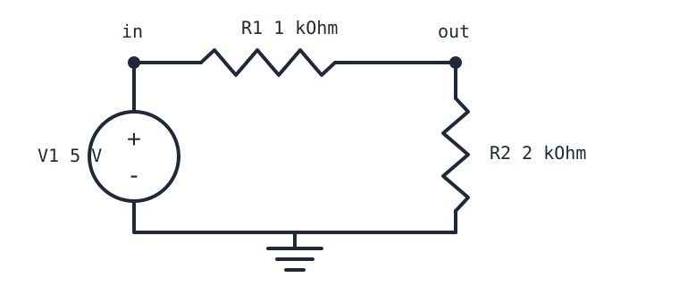

# lean_models

Prove real Python / C++ / Rust / SystemVerilog programs correct in Lean 4.

Each language gets a **deep embedding**: the program's real AST becomes a Lean
value, and a definitional interpreter gives it meaning. Programs stay
**source-shaped** — the Lean term mirrors the file you wrote — so specs and
proofs read against code you recognize, which is what makes AI-assisted proving
tractable.

## Design: four decoupled coverage axes

Coverage on each axis grows independently; nothing on a lower axis blocks a
higher one, and nothing is ever silently faked.

1. **Parse coverage** — borrow each language's own frontend (CPython `ast`,
   Clang, slang, syn). Extractors are thin dumpers into a standardized JSON
   envelope ([docs/envelope-schema.md](docs/envelope-schema.md)).
2. **Representation coverage** — full ASTs in Lean; constructs outside the
   supported vocabulary become `Unsupported` nodes, so ingestion never fails.
3. **Semantic coverage** — tiered, executable, definitional interpreters that
   fail *loudly* (`Res.unsupported`) outside the supported tier. Coverage is
   measured on real corpora.
4. **Proof coverage** — the spec/Hoare layer lags semantics, by design.

**The oracle principle:** all nondeterminism is an explicit oracle parameter of
the semantics. Irrelevant for straight-line Python; essential for
SystemVerilog, where the simulation scheduler's choices become a quantified
argument and theorems can range over *all* legal schedules.

**Validation:** the interpreter is differentially tested against the real
implementation (CPython here) on shared test cases — the semantics is checked
against ground truth, not against our own reading of the spec.

See [docs/DESIGN.md](docs/DESIGN.md) for the full normative contract.

## v0: the Python vertical slice

The workflow — the **three-file example layout**
(`Examples/<language>/<name>/`):

1. Put a pure Python file in its own example directory: `Examples/python/tri/tri.py`.
   No annotations; nothing in it knows Lean exists.
2. Run the extractor:
   `python3 extractors/python/extract.py Examples/python/tri/tri.py`
   This emits `Examples/python/tri/tri.json` — the AST envelope, next to the
   source — and nothing else.
3. Write two Lean files beside it. `spec.lean` is the readable contract:
   the program load, the `#py_check` non-vacuity runs, and every theorem
   *statement*, each proved `:= by proofs`. `proof.lean` holds the real
   proofs. `lake build` ingests the JSON at elaboration time, defines
   `tri : Module` as a literal AST term, and checks everything.

Proof work iterates in **pure Lean**: edit `spec.lean`/`proof.lean`,
rebuild. The extractor re-enters the loop only when the `.py` itself
changes (then re-run step 2 to refresh the envelope).

### Example: `Examples/python/tri/`

```python
# Examples/python/tri/tri.py (the whole program)
def tri(n):
    total, i = 0, 0
    while i <= n:
        total += i
        i += 1
    return total
```

```lean
-- Examples/python/tri/spec.lean (excerpt)
load_program tri from "Examples/python/tri/tri.json"

#py_check tri(10) = 55
#py_check tri(0) = 0
...
theorem tri_total (n : PyInt) (hn : 0 ≤ n) : tri(n) ==> n * (n + 1) / 2 := by proofs
```

The theorem says: for every `n ≥ 0`, running the *actual Python program*
through the verified interpreter terminates and returns `n(n+1)/2`. And the
proof — in `Examples/python/tri/proof.lean`, where the statement is restated under
the same name (Lean has no forward declarations; the spec-side `:= by proofs`
resolves the twin and typechecks the duplication) — is only the content no
tactic can invent: the loop invariant, the decreasing measure, and closing
arithmetic:

```lean
-- Examples/python/tri/proof.lean
theorem tri_total (n : PyInt) (hn : 0 ≤ n) : tri(n) ==> n * (n + 1) / 2 := by
  py_vcgen [tri]
    (inv := fun (total i : Int) => 0 ≤ i ∧ i ≤ n + 1 ∧ 2 * total = i * (i - 1))
    (dec := fun (total i : Int) => (n + 1 - i).toNat)
  case ret =>
    obtain rfl : i' = n + 1 := by omega
    grind
  all_goals grind
```

That is the *entire* proof — the same invariant and measure a pure-Lean
proof of the same fact would need
([`omega`](https://leanprover-community.github.io/mathlib4_docs/Lean/Elab/Tactic/Omega.html)/[`grind`](https://lean-lang.org/doc/reference/latest/The--grind--tactic/)
close the arithmetic residue). No `Val`, no fuel, no AST. `spec.lean` also
carries the derived `@[spec]` corollary forms; the `proofs` tactic is
defined in `LeanModels/Python/Surface.lean`.

The `@[spec]` corollaries are **partial correctness**: *if* the
fuel-bounded interpreter returns a value, that value is `n(n+1)/2`. That
shape can be vacuously true if the interpreter never returns `.ok` (bug,
wrong tier, whatever). Hence the **`#py_check` non-vacuity convention**:
every spec file opens by running the function on concrete inputs and
checking the results at elaboration time, so the "if" side is demonstrably
inhabited before any theorem is trusted.

**Inline mode — also available.** Theorems can instead live in
`# lean[ … # ]` comment blocks inside the `.py` itself; the extractor then
also generates a companion `.lean` file with the blocks spliced in
verbatim. Exactly one example stays in this mode as its end-to-end
showcase — `Examples/python/sum_to/` (source `sum_to.py`, generated companion
`SumTo.lean`; it is also the spec-surface acceptance-test artifact).

The runner and differential harness close the loop:

```
lake exe leanmodels-run Examples/python/tri/tri.json tri 10      # one-line JSON result
python3 harness/diff_test.py                              # Lean vs CPython on harness/cases.json
```

The full check before you finish any change (proofs *or* docs) is:

```
bash tools/ci.sh
```

which runs the Lean build, the CPython differential harness, the extractor
tests, the docs checker, the notebooks, and the SV differential harness
(skipped only when no simulator is on PATH).

`tools/docs_check.py` keeps the documentation honest: every path-marked code
block in `docs/`, this README, and `AGENTS.md` must match the referenced file
verbatim (marker convention in the script's header).

## Real-world demo: `python-rsa`'s modular inverse, proved as shipped

`Examples/python/rsa_inverse/` vendors `extended_gcd` and `inverse` from
**python-rsa 4.9.1 byte-verbatim** (provenance and segment hashes in the
file header; authenticity re-verified against an independent re-download):

```python
# Examples/python/rsa_inverse/rsa_inverse.py (inverse function)
def inverse(x: int, n: int) -> int:
    """Returns the inverse of x % n under multiplication, a.k.a x^-1 (mod n)

    >>> inverse(7, 4)
    3
    >>> (inverse(143, 4) * 143) % 4
    1
    """

    (divider, inv, _) = extended_gcd(x, n)

    if divider != 1:
        raise NotRelativePrimeError(x, n, divider)

    return inv
```

The spec proves total correctness of that routine:

```lean
-- Examples/python/rsa_inverse/spec.lean
theorem inverse_spec (x n : PyInt) (hx : 0 < x) (hn : 1 < n)
    (hco : Int.gcd x n = 1) :
    ∃ r : PyInt, 0 ≤ r ∧ r < n ∧ (r * x) % n = 1 ∧
      rsa_inverse.inverse(x, n) ==> r := by proofs
```

```lean
-- Examples/python/rsa_inverse/spec.lean
theorem inverse_no_raise (x n : PyInt) (hx : 0 < x) (hn : 1 < n)
    (hco : Int.gcd x n = 1) (e : PyErr) :
    ¬ rsa_inverse.inverse(x, n) ==>! e := by proofs
```

The proof (`Examples/python/rsa_inverse/proof.lean`, ~140 non-comment
lines behind the 137-line spec — down from ~330 before the VC walker) is
built around one object — the loop invariant over the six loop variables,
supplied as a clause to a single `py_vcgen` call:

```lean
-- Examples/python/rsa_inverse/proof.lean (the loop clauses)
  py_vcgen [rsa_inverse]
    (inv := fun (a b x y lx ly : Int) =>
      0 < a ∧ 0 ≤ b ∧ Int.gcd a b = Int.gcd A B ∧
      lx * A + ly * B = a ∧ x * A + y * B = b ∧ EgcdPhase A B a b x y lx ly)
    (dec := fun (a b x y lx ly : Int) => b.toNat)
```

— gcd preservation, the two Bézout identities, and a sign-alternation
block (`EgcdPhase`: the coefficient pairs flip signs each iteration) whose
magnitude bounds are what make the post-loop wrap land in range. The
manual rule instantiation, threshold plumbing, and first-iteration unroll
that the pre-walker proof needed are all gone — the walker derives them.

Two things make this more than an exercise. First, `inverse` contains a
`raise NotRelativePrimeError` — an out-of-tier construct — and the proof
handles it by **unreachability**: under `gcd x n = 1` symbolic execution
never enters that branch, so full language coverage is not required to
prove real functions, only the reachable code. Second, proving the loop
surfaced a fact about the shipped library: the textbook Bézout identity
`i*a + j*b = gcd` is **false** for its outputs — the post-loop
negative-coefficient wrap shifts them (`extended_gcd(3, 7) = (1, 5, 1)`,
and `5·3 + 1·7 = 22 ≠ 1`). The honest contract, and what the proof
establishes, is *modular* Bézout (`(i*a) % b = gcd % b` with the wrap
ranges) — which is exactly what `inverse` needs, so the library is
correct, but its real invariant is subtly different from the one its
docstring implies. That distinction is invisible to testing.

## SystemVerilog: the same pipeline, where the interpreter is the simulator

The SV lane (`LeanModels/Sv/**`) is a 4-state (`0/1/X/Z`) cycle-level
scheduler semantics with the LRM's same-region ordering freedom modeled as an
**explicit schedule oracle** `σ` — so theorems quantify over *every legal
schedule*, a property no simulator run can check. Same per-example layout:

```verilog
// Examples/system-verilog/race_blk/race_blk.sv
module race_blk (input logic clk);          // blocking assigns: a race
  logic [7:0] a = 8'd1, b = 8'd2;
  always @(posedge clk) a = b;
  always @(posedge clk) b = a;
endmodule
```

Concrete runs in `#sv_check` surface syntax — including the same design under
*two different legal schedules*, with different outcomes:

```lean
-- Examples/system-verilog/race_blk/spec.lean
#sv_check raceBlkDesign [[clk := 1]] shows a = [2], b = [2]
#sv_check raceBlkDesign [[clk := 1]] under σ_rev shows a = [1], b = [1]
```

```lean
-- Examples/system-verilog/race_blk/spec.lean
theorem race_blk_not_deterministic : ¬ Deterministic raceBlkDesign := by proofs
```

That nondeterminism theorem is the point: a simulator shows you *one*
schedule; the proof shows the race exists across *all* of them — and the
proof is two concrete schedule witnesses plus kernel evaluation:

```lean
-- Examples/system-verilog/race_blk/proof.lean
theorem race_blk_not_deterministic : ¬ Deterministic raceBlkDesign := by
  intro h
  have := h σ_src σ_rev raceStim _ _ ⟨8, race_blk_src⟩ ⟨8, race_blk_rev⟩
  exact absurd this (by decide)
```

Dually, `Examples/system-verilog/counter/spec.lean` proves the gallery's golden-model
refinement — for every legal schedule, from the first sampled reset the
counter follows its one-line Lean model — with the proof riding the
canonical-trace lemmas through `sv_prove`:

```verilog
// Examples/system-verilog/counter/counter.sv
module counter (input  logic clk, rst,
                output logic [7:0] count);
  always_ff @(posedge clk)
    if (rst) count <= '0;
    else     count <= count + 8'd1;
endmodule
```

```lean
-- Examples/system-verilog/counter/spec.lean
theorem counter_refines : counterDesign ⊑@clk[from rst] counterModel := by proofs
```

```lean
-- Examples/system-verilog/counter/proof.lean
theorem counter_refines : counterDesign ⊑@clk[from rst] counterModel := by
  sv_prove [counter_from_reset, sampledRst_eq, counterModelRun_eq, counter_firstOutput]
```

All six extracted designs are proved in this layout: `swap_nba`
(the nonblocking swap is correct under *every* schedule), `adder` (known
inputs add — and one `x`/`z` bit in either operand x-poisons all eight sum
bits, the LRM §11.4.3 whole-vector collapse), `xsel` (X-optimism: an `x`
or `z` select provably takes the `else` branch, per §12.4), and `toggle`
(a reset/enable T-flip-flop refining its two-input golden model from the
first sampled reset).

Validation is differential, like the Python lane: `harness/sv/diff_test.py`
replays the same stimuli through a real simulator and the Lean interpreter
and diffs the traces — against **Xcelium** where installed (`--sim auto`
prefers it) and **Icarus Verilog** otherwise (installed in cloud CI via apt),
including the x/z 4-state cases. The startup-`x` behavior (`count` is `x`
through every pre-reset edge, because `x + 1 = x`) is LRM truth that
2-state simulators hide — here it is both tested and part of the proofs.

## Analog circuits: physical laws as definitions, contracts as interfaces

The third lane (`LeanModels/Spice/**`) takes SPICE netlists. No new
axioms enter: Kirchhoff's laws and the device laws are the *definition* of
the satisfaction relation — `Satisfies c a` means "KCL holds at every node,
every element obeys its law, ground is 0" — exactly as `callFunction`
defines Python's semantics. And because linear DC circuits with rational
element values have exactly rational operating points, theorems are **exact
kernel arithmetic over ℚ**: it is ngspice and Cadence Spectre, running the
same netlist in floating point, that *approximate our answers* in the
differential harnesses, not the other way round.



<!-- docs-check: Examples/spice/typed_divider/typed_divider.cir -->
```spice
Typed circuit architecture divider
V1 in 0 DC 5
R1 in out 1k
R2 out 0 2k
.op
.end
```

```lean
-- Examples/spice/typed_divider/spec.lean
load_circuit typedDivider from
  "Examples/spice/typed_divider/typed_divider.cir"

#circuit_check typedDivider dc shows "out" = (10 / 3 : Rat)

theorem typed_divider_out :
    typedDivider ⊨dc {
      v, _i => v (node! typedDivider "out") = 10 / 3
    } := by proofs

theorem typed_divider_realizable :
    RealizableDC typedDivider := by proofs
```

```lean
-- Examples/spice/typed_divider/proof.lean
theorem typed_divider_out :
    typedDivider ⊨dc {
      v, _i => v (node! typedDivider "out") = 10 / 3
    } := by
  circuit_dc

theorem typed_divider_realizable :
    RealizableDC typedDivider := by
  circuit_dc
```

`load_circuit` parses the `.cir` source directly in Lean, checks names and
hierarchy, and generates an exact finite MNA solution with a kernel-checked
satisfaction certificate. `circuit_dc` proves the universal property from
the resulting physical equations. The separate realizability theorem makes
the universal claim non-vacuous.

The analysis-independent [circuit assurance
core](docs/circuit-assurance-architecture.md) extends that exact DC lane with
relational real-valued behavior and separate safety, realizability,
determinacy, and model-domain obligations. The
[robust divider](Examples/spice/robust_divider/spec.lean) proves a tight
output interval across source and resistor corners without sampling. The
[loaded RC network](Examples/spice/loaded_rc/spec.lean) proves continuous DAE
existence and uniqueness, monotone no-overshoot settling, an explicit
epsilon deadline, and a separate backward-Euler no-overshoot theorem for
every positive timestep.

The [CMOS AND gate](Examples/spice/and_gate/spec.lean) starts the nonlinear
device tier with a six-transistor NAND-plus-inverter deck. Lean
validates the shared typed circuit into a resolved MOS1 capability, where
nodes, sources, transistors, and models have distinct identifier types and
each transistor carries its resolved exact model parameters. The physical
semantics never looks up a model or port through a bare `String`.
`load_circuit` parses the `.cir` source directly and fails loudly if
the requested MOS1 projection cannot be performed. `mos_node!` checks every port name
against the loaded circuit, and `mos1_extract` generates the local KCL and
voltage-bound facts used in the proof. Testbench voltage sources are absent
from the component deck; inputs and `vdd` are explicit driven ports. Lean
then proves `out = a && b` directly from the deck's restricted MOS Level-1
channel equations, internal/output KCL, and an explicit 0--5 V operating
envelope. Differential harnesses run the same component in ngspice and
Spectre with temporary 0/5 V drivers and check low ≤ 0.5 V and high ≥ 4.5 V.

The [one-bit CMOS half-adder](Examples/spice/half_adder/spec.lean) is the
first hierarchical transistor example: two reusable AND subcircuits, an OR,
and an inverter produce `sum = a xor b` and `carry = a and b`. Its Lean proof
expands the extracted `.SUBCKT` instances to 20 individual MOS1 equations and
reuses the MOS1 AND theorem twice. The
[ripple-adder example](Examples/spice/ripple_adder/spec.lean) builds a full
adder from three such half-adders and proves the unsigned-addition equation
for every bit width by induction. Its committed driver-free 50-bit hierarchy
contains 50 literal instances of that full-adder. Lean checks that expansion
produces exactly 150 calls to an electrically identical copy of the proved
half-adder, then applies the parametric theorem; ngspice and Spectre
independently check all 50 sum bits and carry-out at several vectors. The
hierarchy represents 3,000 MOS transistors without flattening them into the
proof term.

The open
[1T1C cell](Examples/spice/dram_1t1c/spec.lean) now has a source-backed
write-one phase as well as hold and write-zero. Lean projects the MOS
threshold, transconductance, and 30 fF storage capacitance from the `.cir`
deck, derives the piecewise capacitor/MOS1 DAE, and proves every physical
trajectory from the same initial voltage equals its closed-form solution.
From a discharged cell, every such trajectory enters `[3 V, 4 V]` within
1 ns and never exceeds 4 V; a separate theorem constructs the behavior.
Exact finite-time arrival at 4 V is deliberately absent because the static
unboosted model admits an interval of zero-current equilibria. Ngspice and
Spectre only validate these claims numerically.

The [2x2 DRAM bank](Examples/spice/dram_bank_2x2/spec.lean) is a
**source-validated compositional transient-endpoint prototype**. Its open
`.cir` deck contains four 1T1C cells plus transistor decoder, precharge,
two-inverter sense/restore, read mux, and write paths. Lean derives
the enabled precharge-MOS/300 fF bitline DAE and proves that its unique
trajectory reaches `[2.47 V, 2.5 V]` in 10 ns without overshoot. Charge
sharing consumes that finite-time endpoint rather than an assumed
equilibrium. Lean also proves the endpoint relation non-vacuous and
domain-bounded. Cells on unselected wordlines carry physical
zero-leakage 1T1C hold traces, from which preservation is derived. For every
column, selected-row read restoration follows the source-backed
MOS1/capacitor DAE for 1 ns with the bitline clamped by its sense path. The
same physical trajectory continues on unselected columns during a write.
The 2x2 and 256x32 proofs derive `[0 V, 1 V]` for zero and `[3 V, 4 V]` for
one, while cells on unselected rows are exactly preserved. The read equation
manifest explicitly reports its imported legacy two-inverter endpoint
contract; write imports the read endpoint phase. The 2x2 deck's static
two-inverter path is proved only over conservative low/high bands. It is not a
differential regenerative sense amplifier and has no dynamic resolution,
offset, or metastability-exclusion theorem. The source-derived charge-sharing
equations prove at least `3/22 V` against an otherwise precharged reference
for either bit, and a fixed-line composition theorem proves that a nominal
four-MOS latch locally amplifies the corresponding sign with a paired KCL
residual witness. The 2x2 source does not instantiate that connection.

The separate
[differential sense-amplifier example](Examples/spice/dram_sense_amp/spec.lean)
starts that replacement from an open component deck: four cross-coupled
MOS1 devices and two explicit bitline capacitors. Lean projects the complete
typed topology and parameters from the `.cir` source, generates a two-node
capacitor/KCL DAE, exhibits both rail equilibria, and also exhibits the
matched midpoint metastable behavior. Lean then derives an exact scalar
differential-mode DAE from the primitive two-node residual, proves the view
can be lifted back to a physical vector trajectory, and proves pointwise
regeneration throughout the balanced basin `0 < deviation < 5/2`: the
selected node rises, its complement falls, and their common mode is
preserved. It also exhibits the exact nonconstant trajectory
`d(t) = d(0) * exp(10^9 t)` and proves that trajectory satisfies the
primitive DAE for every finite horizon on which `d(t) ≤ 1/2`. Within that
region the scalar solution is unique, and the exhibited primitive behavior
stays between the supply rails and reaches any requested positive
differential by the source-derived logarithmic deadline. Beyond that closed
form, Picard-Lindelof constructs a primitive DAE trajectory through all three
MOS regions for every finite horizon and every initial deviation in
`[0, 5/2]`; a proved barrier keeps the witness between the rails. Determinacy
does not assume that barrier: a global source-field Lipschitz proof and
Grönwall show that every balanced scalar AC trajectory from the same initial
state equals the witness. Thus all such trajectories stay between the rails.
They also regenerate monotonically toward the selected rail. A separate
common-mode energy proof now starts from the primitive two-node KCL
equations: every rail-valid vector behavior with balanced initial data stays
on the balanced manifold, projects exactly into the scalar DAE, and is
therefore determinate. Without assuming balanced common mode, Lean also
proves the local physical direction: at every ordered, nonterminal state in
the 0--5 V rectangle, the primitive DAE strictly increases the voltage
differential. A source-capacitance witness inhabits the residual at every
state. For arbitrary nominal unbalanced initial voltages, Lean now constructs
a primitive finite-horizon DAE behavior and proves a barrier keeps both latch
nodes inside `[0 V, 5 V]`. Uniqueness of all unbalanced physical behaviors,
convergence, mismatched-device and offset margin, and quantitative settling
to a rail tolerance remain open. Ngspice and Spectre independently validate
resolution in both directions.

The endpoint contract is dimension-generic. The concrete
[256x32 bank](Examples/spice/dram_bank_256x32/spec.lean) instantiates it for
8,192 1T1C cells without enumerating cells in the proof. The loader rejects
malformed hierarchy and unsupported model profiles. Separate kernel theorems
project its numeric parameters and typed cell/row/subarray/column/bank
topology from the embedded source. Unlike the 2x2 source, each 256x32 column
now contains a precharged reference line, paired transmission-gate coupling,
and a four-MOS/two-capacitor differential latch with separately driven sense
rails. Lean projects that topology and its latch parameters, proves the
primitive residual is inhabited, and proves that any rail-valid,
correctly-ordered nonterminal state reached by coupling regenerates in the
correct direction. Lean now also constructs the finite transmission-gate
trajectory from the derived bitline/reference state: it satisfies the four
capacitor-KCL/MOS1 equations, conserves each pair's charge, stays in
`[2 V, 3 V]` without overshoot, exists for every finite nonnegative horizon,
and establishes the required fixed-polarity latch ordering after every
positive duration. Feeding that state into the primitive latch residual
proves the differential initially regenerates in the correct direction. The
coupling endpoint now also initializes an inhabited finite-horizon
four-MOS/two-capacitor DAE behavior whose two node voltages are proved to stay
inside the supply rails. Unbalanced determinacy, convergence, its resolution
deadline, and physical restore are still open, so the whole-bank endpoint
theorem continues to report the legacy sense contract as an imported
dependency. Ngspice and Spectre exercise both polarities
through the 16,000-plus-device hierarchy as validation, never as theorem
premises.

This is currently an end-to-end theorem from the stated compact-model
physics, not yet from microscopic semiconductor physics. The exact assurance
boundary and the unproved quantum-transport, drift-diffusion, simulator-solver,
and flattened-wiring refinement obligations are recorded in
[the device-level specification](docs/spice-device-levels.md).

The lane is **compositional from day one**: `.SUBCKT` hierarchy is retained by
the direct Lean frontend, and a linear block's interface is captured
*exactly* by a small port contract (`I = Y·V + J` — k² rationals, however
large the block's interior). Sub-blocks are proved once, composed by the
`compose_contracts` metatheorem, and global properties follow from local
ones. The capstone extracts one `attn` subcircuit from `chain.cir`, proves its
two-port relation in both directions, and defines `LoadedChain` only at the
contract boundary. `chain_contract` then quantifies over an **infinite family
of boundary compositions**: induction shows an N-section, 3k-terminated
chain outputs exactly `(2/3)^N · 5` volts. The committed three-section deck
checks source elaboration and simulator agreement; the all-N theorem does not
pretend SPICE has parametric netlist syntax.

Verilog-A uses a separate source boundary. A pinned OpenVAF Reloaded typed
AST performs preprocessing and parsing, and Lean checks a deterministic
projection before lowering contributions into the same relational circuit
core. Unsupported constructs are rejected. Verilog-A is the active analog
HDL scope. Full Verilog-AMS source parsing, connect-module elaboration, and
hybrid execution semantics are deferred in
[the backlog](docs/backlog.md). The frontend-independent sampled analog/SV
relation remains useful infrastructure, but it is not presented as
Verilog-AMS support.

## Repo layout

| Path | What |
|---|---|
| `docs/DESIGN.md` | Authoritative interface contract (names, signatures, formats) |
| `docs/envelope-schema.md` | JSON envelope schema (v0.1, Python payload) |
| `LeanModels/Core/Basic.lean` | Language-neutral core (`Span`) |
| `LeanModels/Python/Ast.lean` | Python AST inductives |
| `LeanModels/Python/Json.lean` | Envelope JSON → AST ingestion |
| `LeanModels/Python/Semantics.lean` | Fuel-based definitional interpreter |
| `LeanModels/Python/Logic.lean` | `ToExpr`, `load_program` macro, `CallsTo`, `@[spec]` |
| `LeanModels/Python/Tests.lean` | Interpreter smoke tests (`#guard` / `#eval`) |
| `LeanModels/Spice.lean` | Mathlib-enabled SPICE lane umbrella |
| `LeanModels/Circuit/**` | Analysis-independent relational assurance core |
| `LeanModels/VerilogA/**` | Typed Verilog-A contribution lowering |
| `extractors/python/extract.py` | Extractor + `# lean[` scanner + companion generator (inline mode) |
| `extractors/veriloga/` | Pinned OpenVAF typed-AST projection; no handwritten Verilog-A parser |
| `Examples/python/<name>/` | Python examples: pure `.py` source + generated envelope + hand-written `spec.lean` and `proof.lean` |
| `Examples/system-verilog/<name>/` | SystemVerilog examples: pure `.sv` source + generated envelope + hand-written `spec.lean` and `proof.lean` |
| `Examples/spice/<name>/` | SPICE examples: pure `.cir` component + hand-written `spec.lean` and `proof.lean` |
| `Examples/python/sum_to/` | The one inline-mode example: `# lean[` blocks in `sum_to.py` + generated companion `SumTo.lean` |
| `Main.lean` | `leanmodels-run` CLI |
| `harness/` | Differential tests: Python vs CPython, SV vs Xcelium/Icarus, and circuit semantics vs ngspice/Spectre |
| `tools/docs_check.py` | Docs drift checker: path-marked doc code blocks must match the tree |

Toolchain: `leanprover/lean4:v4.33.0-rc1` (pinned). The Python and
SystemVerilog lanes use core Lean only. The SPICE proof surface depends on
the matching Mathlib release for exact algebra automation; its semantics,
MNA solver, and generated certificates remain computable definitions over
core `Rat`. Extractor/harness require only Python ≥ 3.9 stdlib.

## v0 limitations (honest list)

- **Semantic tier is narrow.** Ints (arbitrary precision, exact), bools, strs,
  lists, tuples, `None`; `while`/`if`/assignment/tuple-unpacking; `for` over
  lists and tuples (`break`/`continue`/tuple targets included; `for … else`
  and `for` over strs are out of tier); calls to module-level functions
  (positional args) and the builtins `len`, `sorted`, `max`, `min`, `abs`,
  `int`; recursion. Anything else is representable but evaluates to
  `Res.unsupported` — loudly, never wrongly.
- **No floats.** True division `/` and negative `**` exponents are
  `unsupported`.
- **Constant globals only (G1); no closures, no module-init effects.**
  Top-level `NAME = <call-free constant expr>` and tuple-unpack bindings
  (`A1, H1, A8, H8 = 91, 98, 21, 28`) are evaluated in source order and
  visible from function bodies; a binding whose RHS is out of tier resolves
  loudly to `unsupported`, and after any top-level statement that could bind
  names invisibly (`import`, `class`, `for`, …) an unresolved name is
  `unsupported` instead of `NameError`. Functions still run in fresh
  environments (no `global` writes).
- **No try/raise** — but runtime errors are real and faithful
  (`TypeError`, `NameError`, `ZeroDivisionError`, `IndexError`, `ValueError`).
- **Partial correctness via fuel.** Every interpreter function consumes fuel;
  out of fuel is `.timeout`. Theorems say "if it returns `.ok r`, then …" —
  termination is not proved (the `#guard` convention keeps this non-vacuous on
  concrete inputs).

## Roadmap (not built — do not expect it in this tree)

- **Verilog-AMS**: unified analog/digital source parsing, connect-module
  insertion, and superdense mixed-signal execution are explicitly deferred.
  The active analog HDL frontend is Verilog-A. See
  [`docs/backlog.md`](docs/backlog.md) for the prerequisites and assurance
  gates.
- **SystemVerilog beyond M0** (the built slice is described above): event-driven
  time (`initial`, `#` delays), hierarchy/instantiation, and the full-LRM tiers
  measured by the 21k-test conformance census (`docs/sv-corpus-coverage.md`) —
  frequency-ordered, like the Python tier roadmap. See `docs/sv-design-m0.md`
  and `docs/sv-integration-checklist.md` for what is deliberately deferred.
- **C++ and Rust lanes**: same pipeline (Clang / syn frontends → envelope →
  deep embedding → tiered interpreter).
- **`mvcgen` integration**: hook the spec layer into Lean's verification
  condition generator instead of hand-rolled Hoare reasoning.
- **Differential testing at scale**: run the interpreters against reference
  implementations on real corpora as the standing semantics-validation
  methodology, with per-tier coverage numbers.
